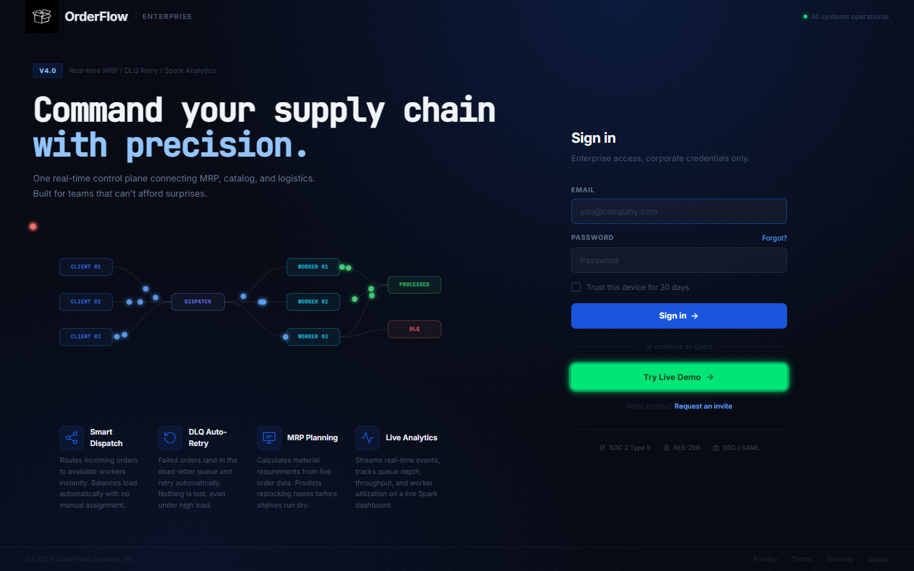
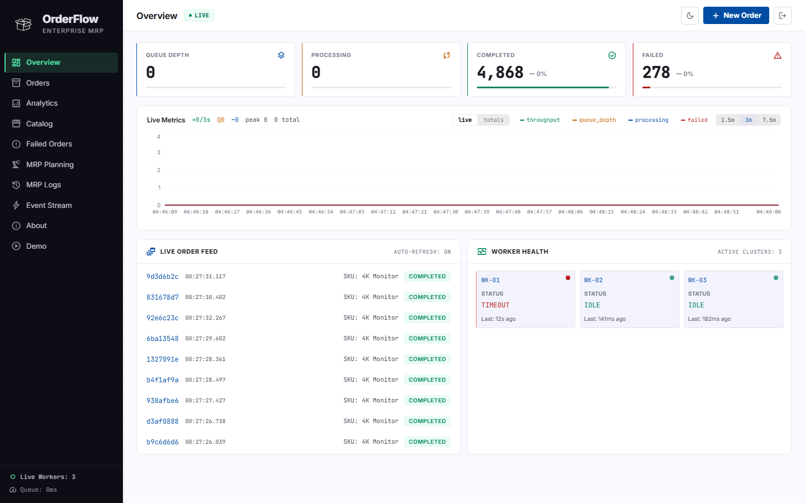
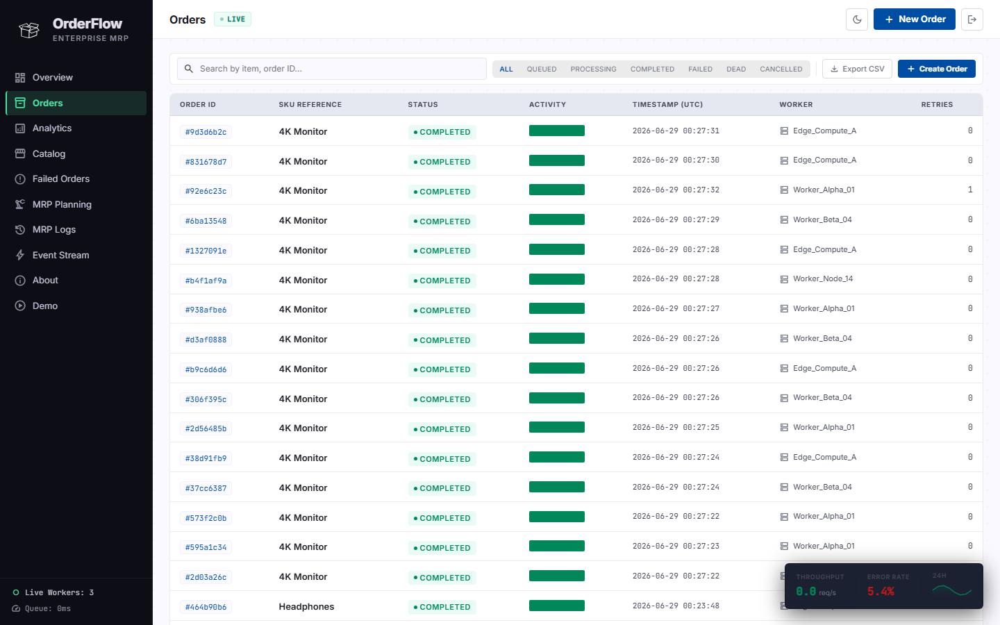
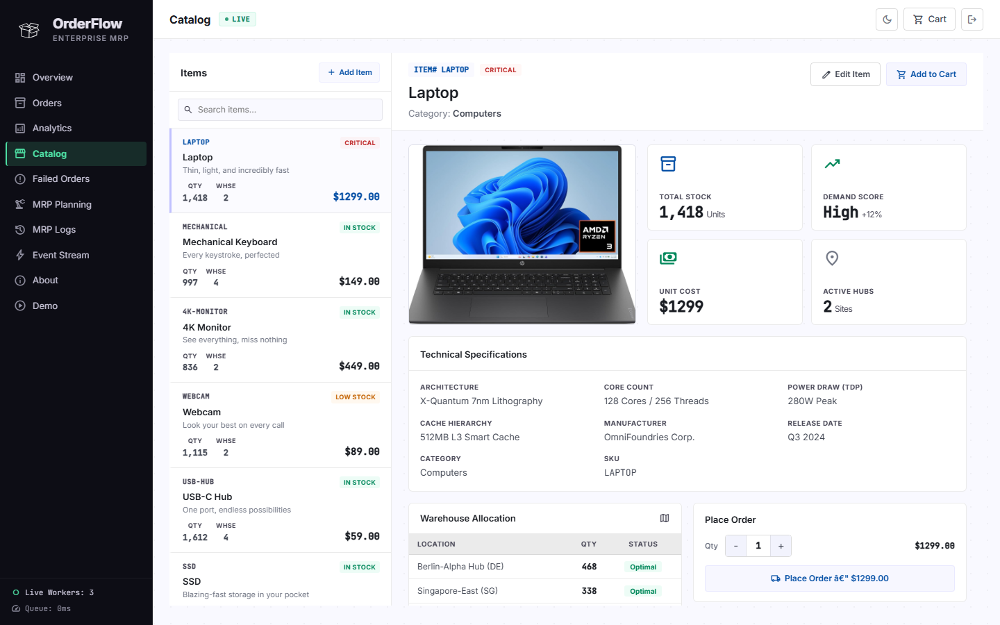
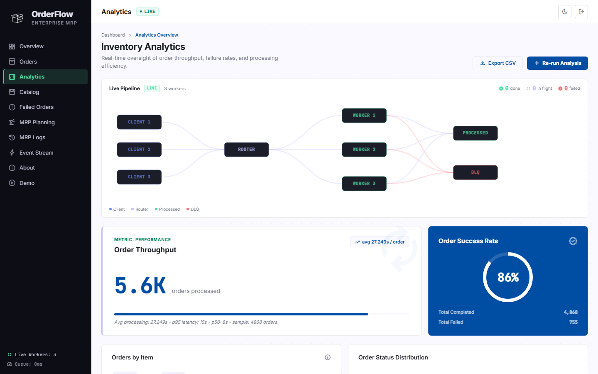
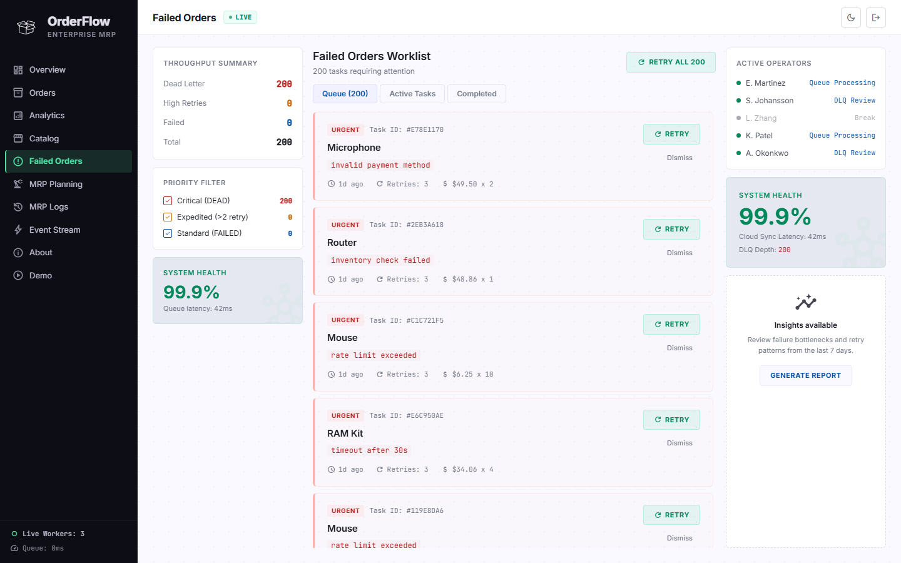
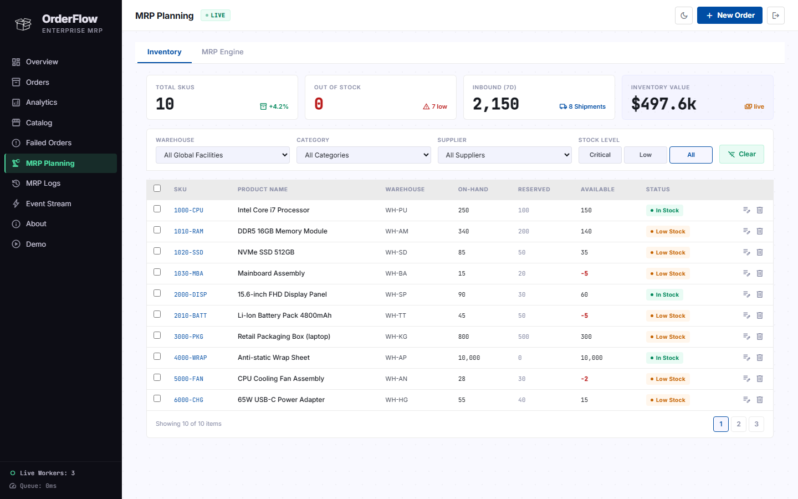
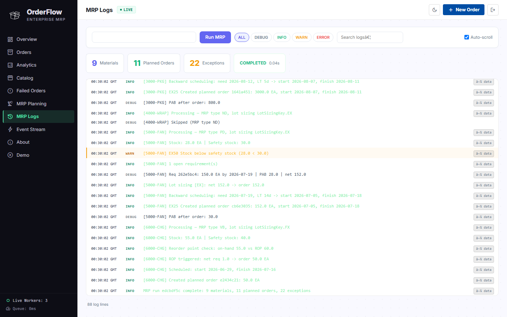
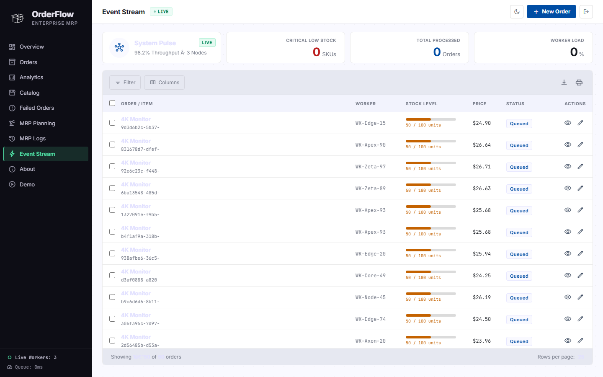
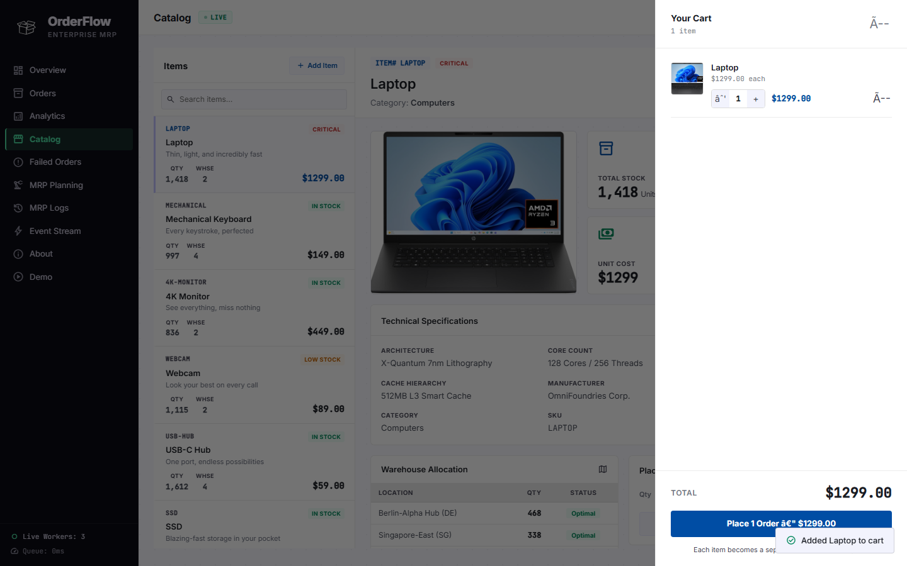

# OrderFlow — Enterprise MRP & Order Processing Platform

> **Live demo:** https://orderflow-ui-kappa.vercel.app

A full-stack, production-grade order management and manufacturing resource planning (MRP) platform. Orders flow through a real message queue, get processed by concurrent workers, and every state change is broadcast over Server-Sent Events to a live React dashboard.

---

## Screenshots

### Landing


### Overview — Live Queue & Worker Health


### Orders — Browse, Search & Manage


### Catalog — Place Real Orders into the Queue


### Analytics — Batch Throughput & Success Rate


### Failed Orders (DLQ) — Inspect, Retry, Dismiss


### MRP Planning — Inventory & Net Requirements


### MRP Logs — Live Planning Run Stream


### Event Stream — Real-time Order Lifecycle


### Cart — Checkout Flow


---

## What It Does

A customer places an order through the Catalog. That order is pushed onto a Redis queue. Three concurrent worker threads race to pick it up. The winning worker processes it (simulating real work with jitter and configurable failure rates). Every transition — queued, processing, completed, failed — is published on an in-process event bus and streamed live to the browser via SSE. If an order fails enough retries it lands in the Dead Letter Queue (DLQ) where it can be retried or dismissed. The Analytics page runs a pandas batch job across all historical orders and produces throughput, latency, and failure-rate metrics. The MRP engine runs a separate planning thread: it reads current inventory, explodes BOMs, computes net requirements, applies lot-sizing rules, and schedules planned purchase orders with lead-time offsets.

---

## Architecture

```
Browser (React 18 + TypeScript)
    │
    │  REST + SSE
    ▼
FastAPI (Python 3.11)
    ├── /orders          → SQLite via SQLAlchemy
    ├── /metrics         → aggregated from DB
    ├── /events/stream   → SSE (EventSource)
    ├── /analytics/*     → pandas batch on all orders
    ├── /mrp/*           → MRP engine + inventory
    └── /dlq/*           → Dead Letter Queue CRUD
         │
         ├── Redis Queue (fakeredis in dev, real Redis in prod)
         │       └── BLPOP consumed by 3 worker threads
         │
         ├── Event Bus (in-process pub/sub)
         │       └── SSE endpoint subscribes + streams to clients
         │
         └── MRP Worker Thread
                 └── net-requirements engine, BOM explosion, lot sizing
```

**Key design decisions:**
- Single Python process, 3 worker threads — no Celery overhead at demo scale
- `fakeredis` in dev: zero infra, full Redis protocol compatibility
- SSE instead of WebSocket: simpler, HTTP/1.1 compatible, no handshake overhead
- Kafka integration prepared but disabled by default (`KAFKA_ENABLED=false`)

---

## Tech Stack

| Layer | Tech |
|-------|------|
| Frontend | React 18, TypeScript, Create React App |
| UI | Inline CSS, Material Symbols, JetBrains Mono |
| Backend | FastAPI, SQLAlchemy, Pydantic v2 |
| Database | SQLite (dev) / PostgreSQL (prod) |
| Queue | Redis / fakeredis |
| Analytics | pandas, pyarrow (parquet) |
| MRP | Custom engine: BOM explosion, lot sizing, lead-time scheduling |
| SSE | FastAPI `StreamingResponse` + in-process event bus |
| Deployment | Vercel (frontend), Railway / Render (backend) |
| Screenshots | Playwright |

---

## Features

### Real-time Order Pipeline
- Place orders from the Catalog; they immediately appear in the queue
- 3 concurrent workers pick up orders via Redis BLPOP
- Every state change (`queued → processing → completed / failed`) streams live to every open browser tab via SSE
- Live Pipeline visualization on the Analytics page animates packets moving through Router → Workers → Sink in real time

### Overview Dashboard
- KPI cards: Queue Depth, Processing, Completed, Failed — with delta indicators vs previous poll
- Live sparkline chart (throughput, queue depth, processing, failed) with 1.5m / 3m / 7.5m window toggle
- Live Order Feed with real-time status badges
- Worker Health panel: per-worker status (idle / processing / timeout) and last-seen timestamp

### Orders Table
- Full order history with search, filter by status, sort by any column
- Per-row actions: view detail, retry failed orders
- Pagination with configurable page size

### Catalog / Shop
- 10 SKUs with per-warehouse stock levels, supplier lead time, and reorder point data
- Add to cart, adjust quantity, checkout — each cart item becomes a real queued order
- Cart drawer with live item count and running total

### Analytics
- Batch job scans all orders via pandas and outputs 4 parquet files
- Metrics: avg processing time, p50/p95 latency, orders-per-item breakdown, status distribution
- Order Success Rate donut chart
- Export to CSV
- Live Pipeline diagram (SSE-driven): packets animate through the real worker topology, glow on active nodes

### Dead Letter Queue (DLQ)
- Orders that exhaust max retries surface here with full error trace and retry count
- Bulk or individual retry, dismiss (archive), generate report
- System health score shown live (based on failure rate)

### MRP Planning
- Inventory tab: 10+ SKUs across global warehouses, on-hand vs reserved vs available
- MRP Engine tab: run net requirements explosion against current demand forecast
- BOM explosion for multi-level assemblies
- Lot sizing: fixed quantity, lot-for-lot, economic order quantity (EOQ)
- Lead-time scheduling with planned order start and receipt dates
- Full planning log streamed live to MRP Logs page

### Event Stream
- Raw SSE feed rendered as a structured, sortable table
- Filter by order status, worker ID, and stock level
- Column picker, CSV download, print view
- System Pulse header: throughput percentage, active node count, critical stock alert

---

## Project Structure

```
orderflow/
├── api/
│   ├── main.py              # FastAPI app, all routes
│   ├── models.py            # SQLAlchemy ORM models
│   ├── schemas.py           # Pydantic request/response schemas
│   └── database.py          # DB engine + session factory
├── worker/
│   └── worker.py            # Order consumer: Redis BLPOP + state machine
├── events/
│   ├── bus.py               # In-process pub/sub event bus
│   ├── producer.py          # Publishes order events to bus
│   └── consumer.py          # Kafka consumer (optional)
├── mrp/
│   ├── engine.py            # MRP net-requirements, BOM explosion, lot sizing
│   └── seed.py              # Seed inventory + BOM data
├── analytics/
│   ├── pandas_batch.py      # Batch analytics job (pandas → parquet)
│   ├── spark_batch.py       # Spark batch (optional, not enabled)
│   └── export_orders.py     # Order export helper
├── scripts/
│   ├── seed.py              # Seed demo orders
│   └── demo.py              # Demo mode: continuous order injection
├── tests/
│   ├── test_mrp_adversarial.py
│   └── test_bom_explosion.py
├── run.py                   # Entry point: starts FastAPI + workers + MRP thread
├── redis_client.py          # Redis connection (real or fakeredis)
├── frontend/
│   ├── src/
│   │   ├── App.tsx
│   │   ├── api.ts           # API_BASE switching (dev proxy vs prod URL)
│   │   ├── products.ts
│   │   ├── types.ts
│   │   └── components/
│   │       ├── LandingPage.tsx
│   │       ├── AnalyticsPage.tsx    # Live pipeline + batch metrics
│   │       ├── FlowAnimation.tsx    # SSE-driven packet animation
│   │       ├── MRPPage.tsx
│   │       ├── DLQPage.tsx
│   │       ├── EventStream.tsx
│   │       ├── LogsPage.tsx
│   │       ├── ShopPage.tsx
│   │       ├── OrdersTable.tsx
│   │       ├── ActivityFeed.tsx
│   │       ├── MetricsTrail.tsx
│   │       └── Sidebar.tsx
│   ├── vercel.json
│   └── package.json
└── docs/
    └── screenshots/
```

---

## Running Locally

### Prerequisites
- Python 3.11+
- Node.js 18+

### Backend

```bash
cd orderflow
python -m venv .venv
source .venv/bin/activate        # Windows: .venv\Scripts\activate
pip install -r requirements.txt

# Copy env and configure
cp .env.example .env             # set REDIS_FAKE=true for no-Redis dev

python run.py
# FastAPI on http://localhost:8000
# 3 worker threads started automatically
# MRP planning thread started automatically
```

### Frontend

```bash
cd orderflow/frontend
npm install
npm start
# http://localhost:3005
```

### Seed demo data (optional)

```bash
python scripts/seed.py           # insert 50 sample completed orders
python scripts/demo.py           # continuous order injection loop
```

---

## Environment Variables

| Variable | Default | Description |
|----------|---------|-------------|
| `DATABASE_URL` | `sqlite:///./orderflow.db` | SQLAlchemy connection string |
| `REDIS_URL` | `redis://localhost:6379/0` | Redis connection URL |
| `REDIS_FAKE` | `true` | Use in-process fakeredis (no Redis needed) |
| `WORKER_COUNT` | `3` | Number of concurrent order workers |
| `KAFKA_ENABLED` | `false` | Enable Kafka event publishing |
| `KAFKA_BOOTSTRAP_SERVERS` | `localhost:9092` | Kafka broker address |

---

## Deployment

### Frontend — Vercel

```bash
cd frontend
vercel --prod --scope <your-team>
```

Set env var `REACT_APP_API_BASE` to your backend URL in the Vercel project settings.

### Backend — Railway or Render

**Start command:** `python run.py`

**Environment variables to set:**
```
DATABASE_URL=<postgres connection string>
REDIS_URL=<redis connection string>
REDIS_FAKE=false
WORKER_COUNT=3
KAFKA_ENABLED=false
```

---

## API Reference

| Method | Path | Description |
|--------|------|-------------|
| GET | `/health` | Service health and Redis mode |
| GET | `/metrics` | Aggregated queue and worker metrics |
| GET | `/orders` | List orders (paginated, filterable by status) |
| POST | `/orders` | Create and enqueue a new order |
| GET | `/orders/{id}` | Get single order detail |
| GET | `/events/stream` | SSE stream of all order lifecycle events |
| POST | `/analytics/run` | Trigger pandas batch analytics job |
| GET | `/analytics/summary` | Latest batch analytics results |
| GET | `/analytics/export` | Download CSV of all orders |
| GET | `/dlq` | List dead-lettered orders |
| POST | `/dlq/{id}/retry` | Re-enqueue a DLQ order |
| DELETE | `/dlq/{id}` | Dismiss (archive) a DLQ order |
| GET | `/mrp/inventory` | Current inventory snapshot |
| POST | `/mrp/run` | Run MRP net-requirements engine |
| GET | `/mrp/logs` | SSE stream of MRP planning log |

---

## Tests

```bash
pytest tests/ -v
```

- `test_bom_explosion.py` — unit tests for multi-level BOM explosion logic
- `test_mrp_adversarial.py` — edge cases: negative stock, circular BOMs, zero lead time, oversized demand

---

## What's Real vs Demo

| Feature | Status |
|---------|--------|
| Order queue (Redis BLPOP) | Real |
| Worker thread pool | Real |
| SSE event streaming | Real |
| SQLite / PostgreSQL persistence | Real |
| pandas batch analytics | Real |
| MRP net-requirements engine | Real |
| BOM explosion + lot sizing | Real |
| DLQ with retry logic | Real |
| Kafka integration | Stubbed (disabled by default) |
| Spark batch / streaming | Stubbed (disabled by default) |
| Auth / multi-tenant | Not implemented |

---

## License

MIT
